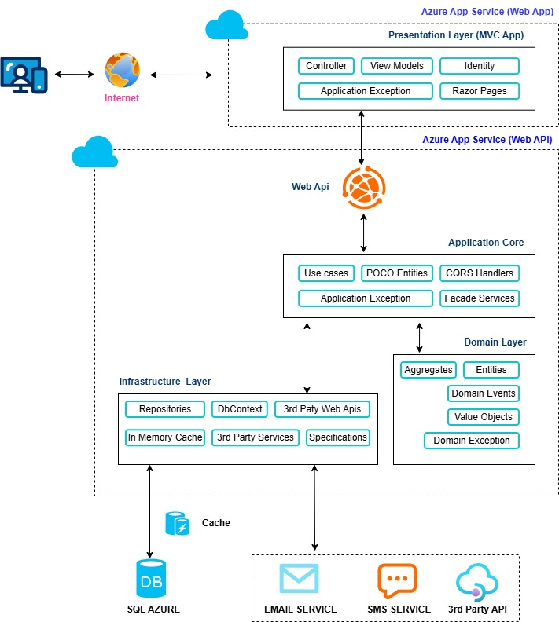

# Clean Architecture with .NET

This repository demonstrates a **Clean Architecture implementation using ASP.NET Core**, designed to showcase scalable, maintainable, and testable application design.

The goal of this project is to serve as a **reference implementation** for building real-world enterprise applications using .NET.

## 🧭 Overview

This solution follows **Clean Architecture principles**, ensuring a clear separation of concerns and long-term maintainability.

The architecture emphasizes:
- Independence from frameworks
- Business logic isolation
- High testability
- Scalability and flexibility

## 🏗️ Architecture Overview


## 🏗️ System Architecture

The following diagram illustrates the high-level architecture of the application, following Clean Architecture principles and separation of concerns.



## 🧩 Tech Stack

- **.NET 8**
- **ASP.NET Core Web API**
- **Entity Framework Core**
- **MediatR**
- **FluentValidation**
- **Clean Architecture**

## 🚀 Getting Started

### Prerequisites
- .NET 8 SDK
- Visual Studio or VS Code

## 📄 License
This project is licensed under the MIT License.

## 🙋‍♂️ About
This repository is part of my professional portfolio, showcasing clean architecture practices and modern .NET development.

### Run the Application

```bash
dotnet restore
dotnet build
dotnet run --project src/CleanArch.API

